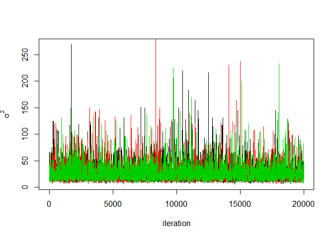

## Metropolis-Hastings 알고리즘 실습
예제 4.3에 대한 MH 알고리즘에서 theta의 후보표본을 다변량 정규분포에서 생성할 때 theta의 원소 모두에 같은 보폭(표준편차)을 사용하였다. 그런데 theta의 원소마다 분산이 다를 수 있고 따라서 적절한 보폭이 다를 수 있으므로 각 원소의 표준편차가 다른 다변량 정규분포를 고려하여 보자.


#### 데이터와 사전모수 입력 및 MH 표본추출 함수 생성

```r
mu0<-10; sigsq0<-25; a<-0.5; b<-1
x<-c(10,13,15,11,9,18,20,17,23,21)
dataList=list(x=x, mu0=mu0, sigsq0=sigsq0, a=a, b=b)

#### compute posterior kernel for Metropolis ####
post.normal_mu_sigsq=function(theta, dataList){
  #--- retrieve data from dataList ---#
  x=dataList$x
  mu0=dataList$mu0
  sigsq0=dataList$sigsq0
  a=dataList$a
  b=dataList$b
  
  mu=theta[1]; sigsq=theta[2]
  f=exp( -0.5*length(x)*log(sigsq) -0.5*sum((x-mu)^2)/sigsq-
           0.5*(mu-mu0)^2/sigsq0-(a+1)*log(sigsq) -b/sigsq )
  return(f)
}


#### Random Walk Metropolis Algorithm ####
Metropolis_normal_mu_sigsq=function(nsim, nburn, delta, dataList, initsList){
  
  #--- initial values of mu and log.sigsq
  mu=initsList$mu
  log.sigsq=log(initsList$sigsq)
  theta.curr=c(mu,log.sigsq)
  p=length(theta.curr)
  
  #==== Start iterations
  para.samples=matrix(0, nsim,p)
  for(iter in 1:(nsim+nburn)){
    z=rnorm(p,0,1)
    theta.prop=z*delta +theta.curr
    mu.curr=theta.curr[1] 
    sigsq.curr=exp(theta.curr[2]) 
    mu.prop=theta.prop[1] 
    sigsq.prop=exp(theta.prop[2]) 
    alpha=post.normal_mu_sigsq(c(mu.prop,sigsq.prop),dataList)/
      post.normal_mu_sigsq(c(mu.curr,sigsq.curr),dataList)*
      sigsq.prop/sigsq.curr 
    if(runif(1) < alpha){theta.next<-theta.prop} else{theta.next<-theta.curr}
    
    theta.curr=theta.next
    
    if(iter > nburn) para.samples[iter-nburn,]=c(theta.next[1], exp(theta.next[2]))
  }
  #=== End iterations
  return(para.samples)
  
}


#### Generate random initial values ####
inits.random = function(x){
  resampledX = sample(x,replace=T)
  muInit = mean(resampledX)
  sigsqInit = var(resampledX)
  return(list(mu = muInit, sigsq = sigsqInit))
}
```


#### 1 & 2) 500개 표본으로 대략적인 추정치와 분산 추정하여 delta 값 구하기

```r
p=2 # num. of para.
nsim=10000; nburn=5000
mcmc.samples=matrix(0, nrow=nsim, ncol=p) # matrix to save samles

delta=1.5

initsList = inits.random(x)
mcmc.samples = Metropolis_normal_mu_sigsq(nsim,nburn,delta,dataList,initsList)


mu.samples = mcmc.samples[,1]
sigsq.samples = mcmc.samples[,2]

delta = sqrt(2.4)*c(sd(mu.samples), sd(log(sigsq.samples))); delta
```

```
## [1] 2.2081732 0.7009638
```

#### 3) N(theta, delta^2)로부터 후보표본 추출

```r
nChains=3
nsim=20000; nburn=5000
mcmc.samples=array(0, dim=c(nsim, p, nChains)) # array to save samles

#### Start iteration ####
for(ich in 1:nChains){
  initsList = inits.random(x)
  mcmc.samples[,,ich] = Metropolis_normal_mu_sigsq(nsim, nburn, delta, dataList, initsList)
}
```


#### 4) mu 와 sigma의 경로그림과 채택확률

```r
mu.samples=mcmc.samples[,1,]
sigsq.samples=mcmc.samples[,2,]

plot(mu.samples[,1], type="l", xlab="iteration",ylab=quote(mu))
lines(mu.samples[,2], col=2)
lines(mu.samples[,3], col=3)
```

<!-- -->

```r
plot(sigsq.samples[,1], type="l", xlab="iteration",ylab=quote(sigma^2))
lines(sigsq.samples[,2], col=2)
lines(sigsq.samples[,3], col=3)

require(coda)
```

<!-- -->

```r
Metro.draws=mcmc(mcmc.samples[,,1])
accept.rate=1-rejectionRate(Metro.draws); accept.rate
```

```
##      var1      var2 
## 0.3859693 0.3859693
```

#### 5) 채택확률이 약 24%가 되도록 delta를 조정

```r
delta2 = delta*1.5; delta2
```

```
## [1] 3.312260 1.051446
```

```r
for(ich in 1:nChains){
  initsList = inits.random(x)
  mcmc.samples[,,ich] = Metropolis_normal_mu_sigsq(nsim, nburn, delta=delta2, dataList, initsList)
}

Metro.draws=mcmc(mcmc.samples[,,1])
accept.rate=1-rejectionRate(Metro.draws); accept.rate
```

```
##      var1      var2 
## 0.2421121 0.2421121
```

```r
delta.final = delta2
```

#### 6) 공통 분산을 사용하였을 경우와 수렴속도, 효율, 사후추론 결과를 비교

```r
# 수렴속도를 비교하기 위해 초기 2000개 표본으로 경로그림 그리기
nChains=3
nsim=2000; nburn=0
mcmc.samples1=array(0, dim=c(nsim, p, nChains))
mcmc.samples2=array(0, dim=c(nsim, p, nChains))


# 공통 분산일 때의 경로그림 및 자기상관 그림
for(ich in 1:nChains){
  initsList = inits.random(x)
  mcmc.samples1[,,ich] = Metropolis_normal_mu_sigsq(nsim, nburn, delta=1.5, dataList, initsList)
}

mu.samples=mcmc.samples1[,1,]
sigsq.samples=mcmc.samples1[,2,]

par(mfrow=c(2,2))

plot(mu.samples[,1], type="l", xlab="iteration",ylab=quote(mu))
lines(mu.samples[,2], col=2)
lines(mu.samples[,3], col=3)

plot(sigsq.samples[,1], type="l", xlab="iteration",ylab=quote(sigma^2))
lines(sigsq.samples[,2], col=2)
lines(sigsq.samples[,3], col=3)

acf(mu.samples[,1], main=quote(mu))
acf(sigsq.samples[,1], main=quote(sigma^2))
```

<!-- -->

```r
# 다른 분산을 사용했을 때의 경로그림 및 자기상관 그림
for(ich in 1:nChains){
  initsList = inits.random(x)
  mcmc.samples2[,,ich] = Metropolis_normal_mu_sigsq(nsim, nburn, delta=delta.final, dataList, initsList)
}

mu.samples=mcmc.samples2[,1,]
sigsq.samples=mcmc.samples2[,2,]

par(mfrow=c(2,2))

plot(mu.samples[,1], type="l", xlab="iteration",ylab=quote(mu))
lines(mu.samples[,2], col=2)
lines(mu.samples[,3], col=3)

plot(sigsq.samples[,1], type="l", xlab="iteration",ylab=quote(sigma^2))
lines(sigsq.samples[,2], col=2)
lines(sigsq.samples[,3], col=3)

acf(mu.samples[,1], main=quote(mu))
acf(sigsq.samples[,1], main=quote(sigma^2))
```

<!-- -->
수렴속도가 어쩌구

```r
# 전체 표본을 사용한 결과 비교
nChains=3
nsim=20000; nburn=5000
mcmc.samples1=array(0, dim=c(nsim, p, nChains))
mcmc.samples2=array(0, dim=c(nsim, p, nChains))

# 공통 분산
for(ich in 1:nChains){
  initsList = inits.random(x)
  mcmc.samples1[,,ich] = Metropolis_normal_mu_sigsq(nsim, nburn, delta=1.5, dataList, initsList)
}

# 경로그림 및 사후밀도 함수
mu.samples=mcmc.samples[,1,]
sigsq.samples=mcmc.samples[,2,]

par(mfrow=c(2,2))

plot(mu.samples[,1], type="l", xlab="iteration",ylab=quote(mu))
lines(mu.samples[,2], col=2)
lines(mu.samples[,3], col=3)

plot(density(mu.samples[,1]), xlab=quote(mu), ylab="posterior density", main="")
lines(density(mu.samples[,2]), col=2)
lines(density(mu.samples[,3]), col=3)

plot(sigsq.samples[,1], type="l", xlab="iteration",ylab=quote(sigma^2))
lines(sigsq.samples[,2], col=2)
lines(sigsq.samples[,3], col=3)

plot(density(sigsq.samples[,1]), xlab=quote(sigma^2), ylab="posterior density", main="")
lines(density(sigsq.samples[,2]), col=2)
lines(density(sigsq.samples[,3]), col=3)
```

<!-- -->

```r
# Gelman 상수 및 채택확률
samples.1=mcmc(mcmc.samples1[,,1])
samples.2=mcmc(mcmc.samples1[,,2])
samples.3=mcmc(mcmc.samples1[,,3])

codaSamples=mcmc.list(list(samples.1, samples.2, samples.3))
gelman=gelman.diag(codaSamples); gelman
```

```
## Potential scale reduction factors:
## 
##      Point est. Upper C.I.
## [1,]          1          1
## [2,]          1          1
## 
## Multivariate psrf
## 
## 1
```

```r
Metro.draws=mcmc(mcmc.samples1[,,1])
accept.rate=1-rejectionRate(Metro.draws); accept.rate
```

```
##      var1      var2 
## 0.2749637 0.2749637
```

```r
# 사후 추론 (mu와 sigma의 주변 사후밀도함수와 95% HPD 구간)
mcmc.samples.combined=rbind(mcmc.samples1[,,1],mcmc.samples1[,,2],mcmc.samples1[,,3])  
para.hat=apply(mcmc.samples.combined, 2, mean)
HPD=apply(mcmc.samples.combined,2,function(x) quantile(x, c(0.025,0.975)) )

par(mfrow=c(1,2))

plot(density(mcmc.samples.combined[,1]),xlab=quote(mu), ylab="", main="")
abline(v=HPD[ ,1], lty=2, col=2)

plot(density(mcmc.samples.combined[,2]),xlab=quote(sigma^2), ylab="", main="")
abline(v=HPD[ ,2], lty=2, col=2)
```

<!-- -->

```r
# 위에서 결정한 delta 사용
for(ich in 1:nChains){
  initsList = inits.random(x)
  mcmc.samples2[,,ich] = Metropolis_normal_mu_sigsq(nsim, nburn, delta=delta.final, dataList, initsList)
}

# 경로그림 및 사후밀도 함수
mu.samples=mcmc.samples2[,1,]
sigsq.samples=mcmc.samples2[,2,]

par(mfrow=c(2,2))

plot(mu.samples[,1], type="l", xlab="iteration",ylab=quote(mu))
lines(mu.samples[,2], col=2)
lines(mu.samples[,3], col=3)

plot(density(mu.samples[,1]), xlab=quote(mu), ylab="posterior density", main="")
lines(density(mu.samples[,2]), col=2)
lines(density(mu.samples[,3]), col=3)

plot(sigsq.samples[,1], type="l", xlab="iteration",ylab=quote(sigma^2))
lines(sigsq.samples[,2], col=2)
lines(sigsq.samples[,3], col=3)

plot(density(sigsq.samples[,1]), xlab=quote(sigma^2), ylab="posterior density", main="")
lines(density(sigsq.samples[,2]), col=2)
lines(density(sigsq.samples[,3]), col=3)
```

<!-- -->

```r
# Gelman 상수 및 채택확률
samples.1=mcmc(mcmc.samples2[,,1])
samples.2=mcmc(mcmc.samples2[,,2])
samples.3=mcmc(mcmc.samples2[,,3])

codaSamples=mcmc.list(list(samples.1, samples.2, samples.3))
gelman=gelman.diag(codaSamples); gelman
```

```
## Potential scale reduction factors:
## 
##      Point est. Upper C.I.
## [1,]          1       1.01
## [2,]          1       1.01
## 
## Multivariate psrf
## 
## 1
```

```r
Metro.draws=mcmc(mcmc.samples2[,,1])
accept.rate=1-rejectionRate(Metro.draws); accept.rate
```

```
##      var1      var2 
## 0.2448622 0.2448622
```

```r
# 사후 추론 (mu와 sigma의 주변 사후밀도함수와 95% HPD 구간)
mcmc.samples.combined=rbind(mcmc.samples2[,,1] ,mcmc.samples2[,,2], mcmc.samples2[,,3])  
para.hat=apply(mcmc.samples.combined, 2, mean)
HPD=apply(mcmc.samples.combined,2,function(x) quantile(x, c(0.025,0.975)) )

par(mfrow=c(1,2))

plot(density(mcmc.samples.combined[,1]),xlab=quote(mu), ylab="", main="")
abline(v=HPD[ ,1], lty=2, col=2)

plot(density(mcmc.samples.combined[,2]),xlab=quote(sigma^2), ylab="", main="")
abline(v=HPD[ ,2], lty=2, col=2)
```

<!-- -->
