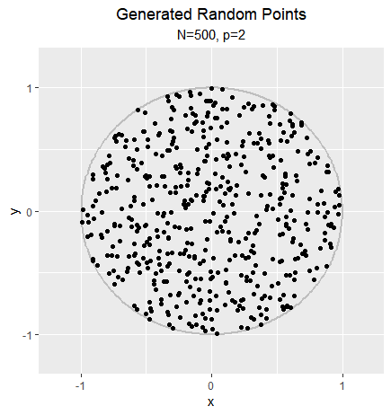
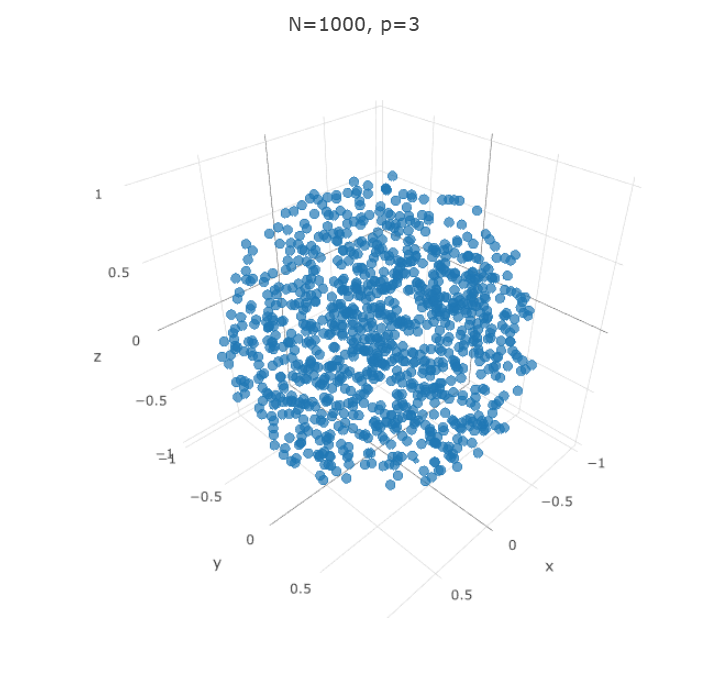

```r
library(ggplot2)
library(plotly)
```

### Generating N random points inside the p-dimensional unit sphere

```r
myftn <- function(n, p){
  
  X <- matrix(rnorm(n*p), nrow=n, ncol=p)
  S <- rowSums(X^2)
  d <- runif(n)^(1/p)
  
  result <- apply(X, 2, function(x){ x*(d/sqrt(S)) })
  return(result)
  
}


## scatterplot을 통해 random points가 잘 generate 되었는지 확인

sample1 <- data.frame(myftn(500, 2))
x <- seq(-1, 1, length.out=250); y <- c(sqrt(1-x^2))

ggplot(sample1) +
  geom_path(aes(x=c(x, rev(x)), y=c(y, -y)), color="grey", size=1) +
  geom_point(aes(x=X1, y=X2)) +
  scale_x_continuous(breaks=c(-1, 0, 1), limits=c(-1.2, 1.2)) +
  scale_y_continuous(breaks=c(-1, 0, 1), limits=c(-1.2, 1.2)) +
  ggtitle("Generated Random Points", subtitle="N=500, p=2") + labs(x="x", y="y") +
  theme(plot.title=element_text(hjust=0.5), plot.subtitle=element_text(hjust=0.5))
```

<!-- -->

```r
sample2 <- data.frame(myftn(1000,3))
plot_ly(x=sample2$X1, y=sample2$X2, z=sample2$X3, type="scatter3d", mode="markers", size=1) %>%
        layout(title="N=1000, p=3")
```

<!-- -->


### 위 함수를 통해 median distance를 구하고 식을 통해 계산한 결과와 비교하기

```r
d <- function(p, n){ (1-(1/2)^(1/n))^(1/p) }

myd <- function(p, n, sim.n=1000){
  result <- c()
  for(i in 1:sim.n){
    x <- myftn(n, p)
    result[i] <- min(sqrt(rowSums(x^2)))
  }
  return(median(result))
}


p <- c(5, 10, 15, 20, 30)

for(N in c(500, 1000, 1500, 2000)){
  print( data.frame(p=p, formula=d(p, N), simulation=sapply(p, myd, n=N)) )
}
```

```
##    p   formula simulation
## 1  5 0.2681087  0.2650311
## 2 10 0.5177921  0.5158985
## 3 15 0.6448177  0.6420659
## 4 20 0.7195777  0.7187025
## 5 30 0.8030054  0.8028725
##    p   formula simulation
## 1  5 0.2334183  0.2333134
## 2 10 0.4831339  0.4859887
## 3 15 0.6157130  0.6163591
## 4 20 0.6950783  0.6922367
## 5 30 0.7846738  0.7850411
##    p   formula simulation
## 1  5 0.2152419  0.2144685
## 2 10 0.4639417  0.4676865
## 3 15 0.5992972  0.5981087
## 4 20 0.6811326  0.6800733
## 5 30 0.7741429  0.7778025
##    p   formula simulation
## 1  5 0.2032095  0.1986161
## 2 10 0.4507877  0.4523668
## 3 15 0.5879152  0.5883083
## 4 20 0.6714072  0.6715670
## 5 30 0.7667563  0.7648868
```
